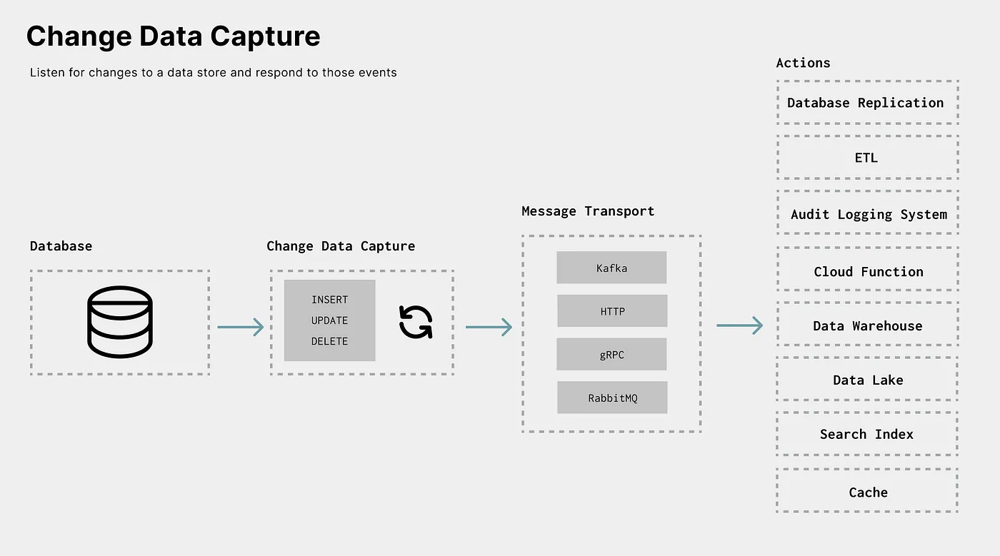
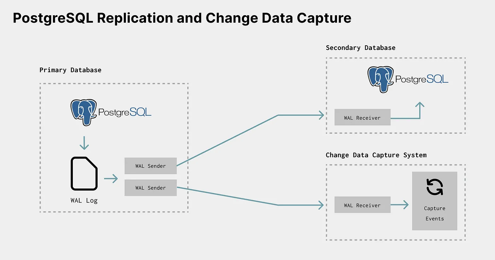

# CDC with Postgres and RabbitMQ
<p align="center">

</p>

This is a poc repo that demonstrating and implementing the Change Data Capture (CDC) concept using Debezium and PostgreSQL. This project focuses on the monitoring and capturing of row-level changes in PostgreSQL tables. Leveraging Debezium, we enable the distribution of these changes, allowing applications to detect and react to data modifications in real-time.

## How to run

1. start docker containers

```sh
docker compose up -d
```

2. Create table customers

```sql
CREATE TABLE public.customers (
	id serial NOT NULL,
	first_name text,
	last_name text,
	email text)
```


2. From [rabbitMQ GUI](http://localhost:15672) create
  - new RabbitMQ Topic Exchange called `tutorial.public.customers`
  - new RabbitMQ Queue called `public.customers` and bind it with the exchange using routing key `inventory_customers`


3. start backend server

```sh
yarn
```

```sh
yarn dev
```

make sure that debezium-server is up and running. if not you can run

```sh
docker compose up debezium-server -d
```


4. inserting new row to customers table. you can use [tableplus](https://tableplus.com/) or run this query

```sql
INSERT INTO public.customers (first_name, last_name, email) VALUES ('john', 'doe', 'test@test.com')
```

you should see output like this in your terminal
```
Received message from inventory_customers {
  schema: {
    type: 'struct',
    fields: [ [Object], [Object], [Object], [Object], [Object], [Object] ],
    optional: false,
    name: 'tutorial.public.customers.Envelope',
    version: 1
  },
  payload: {
    before: null,
    after: {
      id: 1,
      first_name: 'john',
      last_name: 'doe',
      email: 'test@test.com'
    },
    source: {
      version: '2.4.2.Final',
      connector: 'postgresql',
      name: 'tutorial',
      ts_ms: 1707280833586,
      snapshot: 'false',
      db: 'postgres',
      sequence: '["25673144","25681696"]',
      schema: 'public',
      table: 'customers',
      txId: 739,
      lsn: 25681696,
      xmin: null
    },
    op: 'c',
    ts_ms: 1707280833602,
    transaction: null
  }
}
```

## References
- [Streaming CDC Events using RabbitMQ and Debezium](https://medium.com/greenplum-data-clinics/streaming-cdc-events-from-any-database-to-greenplum-data-warehouse-using-rabbitmq-and-debezium-5eccc678dfae)


<p align="center">

</p>
